# Project: Crawling *ArXiv* Using BeautifulSoup(BS), Scrapy and Selenium

Created by Kunhong Yu(444447) and Ludi Feng(437847)

In this repo, we step through how to use our code in this project.

## Background

In this project, we extend what we have learnt during our lecture, and scrape a famous academic paper hosting platform: *ArXiv*, which is developed by Cornell University. Specifically, when first entering its main page(https://arxiv.org/), we split what we need into subject –> subsubject –> subsubsubject(e.g. Physics –> Astrophysics –> Cosmology and Nongalactic Astrophysics), we first get each subsubsubject’s link, then skip to the each subsubsubject’s page to scrape each paper’s link and go to the each paper’s page to scrape its title, authors, abstract and comment, finally, we want to know each paper’s first author’s old papers to see which area this author was dedicated to. In order to analyse what we scrape, we use simple PCA and NLP techniques in machine learning to make 2d and 3d visualization to understand data we obtain.

## Prerequsite

In order to run our code, you have to install some external packages by running the following command.

```Python
pip install -r requirements.txt
```

## Code Organization
```bash
<<<<<<< HEAD
├── main.py
├── processing
│   ├── __init__.py
│   ├── data_pre.py
│   ├── pca.py
│   └── process.py
├── records
│   ├── bs_records.txt
│   └── scrapy_records.txt
├── requirements.txt
├── run.sh
├── soup
│   ├── config.py
│   ├── crawl.py
│   ├── data
│   │   ├── 2dallauthorsinfoPCA.png
│   │   ├── 2dallinfoPCA.png
│   │   ├── 3dallauthorsinfoPCA.png
│   │   ├── 3dallinfoPCA.png
│   │   ├── allauthorsinfo.csv
│   │   └── allinfo.csv
│   ├── main.py
│   └── utils
│       ├── __init__.py
│       ├── other_utils.py
│       └── scrape_utils.py
├── sscrapy
│   ├── __init__.py
│   ├── command
│   │   ├── __init__.py
│   │   ├── command
│   │   │   ├── __init__.py
│   │   │   ├── items.py
│   │   │   ├── middlewares.py
│   │   │   ├── pipelines.py
│   │   │   ├── settings.py
│   │   │   └── spiders
│   │   │       ├── __init__.py
│   │   │       └── command.py
│   │   └── scrapy.cfg
│   ├── config.py
│   ├── crawl.py
│   ├── data
│   │   ├── 2dallauthorsinfoPCA.png
│   │   ├── 2dallinfoPCA.png
│   │   ├── 3dallauthorsinfoPCA.png
│   │   ├── 3dallinfoPCA.png
│   │   ├── allauthorsinfo.csv
│   │   └── allinfo.csv
│   ├── main.py
│   └── utils
│       ├── __init__.py
│       ├── other_utils.py
│       └── scrape_utils.py
└── sselenium
    ├── config.py
    ├── crawl.py
    ├── data
    │   └── allinfo.csv
    └── main.py
```
We define three main folders: `soup`, `sscrapy`, `sselenium`, which contain all codes corresponding to three tools: BeautifulSoup, Scrapy and Selenium respectively, however, according to project requirements, we have to name them as soup, scrapy and selenium, but it's not possible if we import off-and-shelf packages called scrapy and selenium, so we must rename our folders. In each folder, all files look almost the same, they all have `data` and `utils` folders, in the `data` folder, results are stored and `utils` includes core scraping classes and functions related to the specific tool, moreoever, `config.py` is used to set parameters globally, `crawl.py` is used to call scraping functions in `utils`, finally, `main.py` is the code entrance for the  corresponding tool. In `sscrapy`, there is a folder `command`, which is a scrapy project being used to start crawling by typing `scrapy ...` in command line. In `sselenium` folder, we simplify the process with only three common files like in `soup` and `sscrapy` since it's much easier for selenium to work with this page, and we don't scrape each author's related papers with selenium.


**For glove.6B.50d.txt, you have to go [here](https://nlp.stanford.edu/data/glove.6B.zip) to download it and put it into `./processing/` folder.**
=======
├── main.py
├── processing
│   ├── __init__.py
│   ├── data_pre.py
│   ├── glove.6B.50d.txt
│   ├── pca.py
│   └── process.py
├── records
│   ├── bs_records.txt
│   └── scrapy_records.txt
├── requirements.txt
├── run.sh
├── soup
│   ├── config.py
│   ├── crawl.py
│   ├── data
│   │   ├── 2dallauthorsinfoPCA.png
│   │   ├── 2dallinfoPCA.png
│   │   ├── 3dallauthorsinfoPCA.png
│   │   ├── 3dallinfoPCA.png
│   │   ├── allauthorsinfo.csv
│   │   └── allinfo.csv
│   ├── main.py
│   └── utils
│       ├── __init__.py
│       ├── other_utils.py
│       └── scrape_utils.py
├── sscrapy
│   ├── __init__.py
│   ├── command
│   │   ├── __init__.py
│   │   ├── command
│   │   │   ├── __init__.py
│   │   │   ├── items.py
│   │   │   ├── middlewares.py
│   │   │   ├── pipelines.py
│   │   │   ├── settings.py
│   │   │   └── spiders
│   │   │       ├── __init__.py
│   │   │       └── command.py
│   │   └── scrapy.cfg
│   ├── config.py
│   ├── crawl.py
│   ├── data
│   │   ├── 2dallauthorsinfoPCA.png
│   │   ├── 2dallinfoPCA.png
│   │   ├── 3dallauthorsinfoPCA.png
│   │   ├── 3dallinfoPCA.png
│   │   ├── allauthorsinfo.csv
│   │   └── allinfo.csv
│   ├── main.py
│   └── utils
│       ├── __init__.py
│       ├── other_utils.py
│       └── scrape_utils.py
└── sselenium
    ├── config.py
    ├── crawl.py
    └── main.py
```
We define three main folders: `soup`, `sscrapy`, `sselenium`, which contain all codes corresponding to three tools: BeautifulSoup, Scrapy and Selenium respectively, however, according to project requirements, we have to name them as soup, scrapy and selenium, but it's not possible if we import off-and-shelf packages called scrapy and selenium, so we must rename our folders. In each folder, all files look almost the same, they all have `data` and `utils` folders, in the `data` folder, results are stored and `utils` includes core scraping classes and functions related to the specific tool, moreoever, `config.py` is used to set parameters globally, `crawl.py` is used to call scraping functions in `utils`, finally, `main.py` is the code entrance for the  corresponding tool. In `sscrapy`, there is a folder `command`, which is a scrapy project being used to start crawling by typing `scrapy ...` in command line. **For glove.6B.50d.txt, you have to go [here](https://nlp.stanford.edu/data/glove.6B.zip) to download it and put it into `./processing/` folder.**

>>>>>>> e7b8b23db5988ddd218b6275de838a3c7e89c2f8
`processing` folder contains all operations about data analyses, `records` stores running time records for three tools, moreover, `main.py` in the mainstream folder is the entrance of all the project, `requirements.txt` describes all needed external packages to run our code, `run.sh` is running script, one can also run code by typing `./run.sh` in command line with default parameters. More details can be found in our `description.pdf` file.

## Usages

### Parameters

<<<<<<< HEAD
In our code there is some parameters set for three tools.
=======
In our code there is some parameters set for all three tools.
>>>>>>> e7b8b23db5988ddd218b6275de838a3c7e89c2f8

```
limit = 5                   
page_limit = True
analyse = True
scrape_each_author = False
crawl = True
subject = ['Computer Science', 'Physics', 'Mathematics']
ssubject = ['Computing Research Repository', 'Physics', 'Mathematics']
sssubject = ['Computer Vision and Pattern Recognition', 'Machine Learning', 'Applied Physics','functional analysis']
```

`limit` is used to limit the number of scraped papers for each subsubsubject, if `page_limit` is set to be True(default), then `limit` is useless, however, the number of **all** scraped papers will be more or less 100 according to project requirements, we define 100 pages as 100 papers. When `scrape_each_author` set to be True, then after crawling all papers of all subsubsubjects specified by users, our code will start crawling each paper's first author's written papers according to papers we scraped, in this setting, default scraped pages will be as 100/150 depending on which tool we use, and the number of scraped results will also be almost 100 when `page_limit` is set to be True. Sometimes, you may only have interest in analysing data, then you have to set `crawl` to be False and `analyse` to be True, but it is necessary to have pre-scraped results stored. However, if you want to test how our program works, just running our code with default parameters is enough. 
<<<<<<< HEAD
Moreover, you can also define your own favoriate `subject`, `subsubject` and `subsubsubject` in Python list format, but using our default values can be adequate to test program. However, in Selenium, we don't scrape for each author's papers.

=======
Moreover, you can also define your own favoriate `subject`, `subsubject` and `subsubsubject` in Python list format, but using our default values can be adequate to test program.
>>>>>>> e7b8b23db5988ddd218b6275de838a3c7e89c2f8

### Usages for Running

#### Running with a single line of command

In order to make our code more like a full and *real* project, we abstract program entrance into `main.py` in the mainstream(first-level) folder. To run it, just typing

```python
python main.py main \
--subject="['Computer Science','Physics','Statistics']" \
--ssubject="['Computing Research Repository','Physics','Statistics']" \
--sssubject="['Computer Vision and Pattern Recognition','Machine Learning','Applied Physics','Methodology']" \
--limit=5 \
--scrape_each_author=True \
--crawl=True \
--analyse=True \
--page_limit=False
```

`--x=y` is used to set parameter `x` as mentioned before to have value `y`.

Or you may run our `bash` script by typing

```bash
./run.sh 
```

But you may go to the `run.sh` file to modify parameters if necessary.
Then you will see the following choices and type `2` to continue with `scrapy` tool:

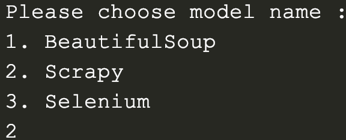

Then parameters you set will be printed.

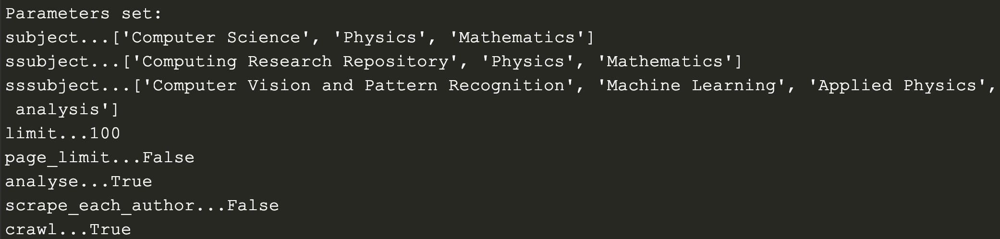

Firstly, our code will find all subsubsubjects' links, then a glimpse of output for BS is 

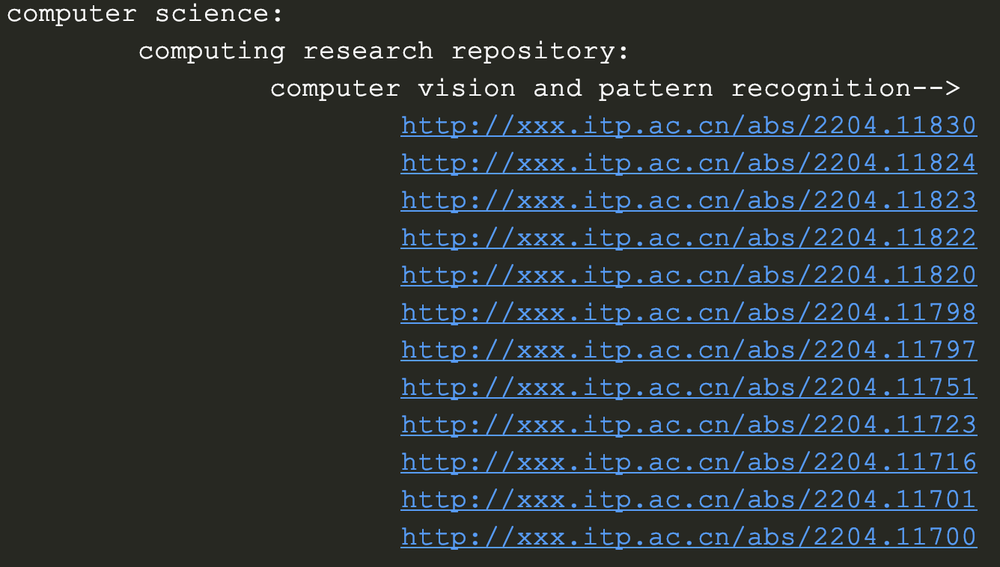

In this output, we can see all papers' links are scraped under each subsubsubject. Due the natural 
mechanism of Scrapy, the output is 

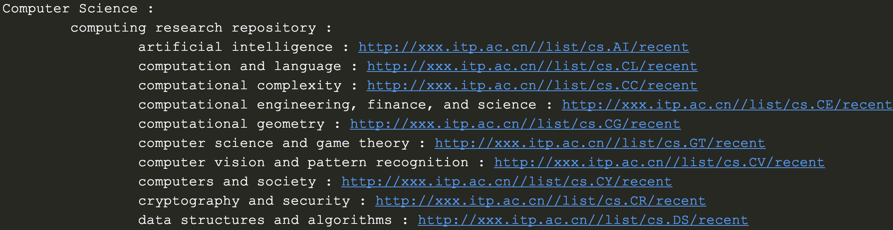

All subsubsubjects' links are illustrated. 
Next step is to get each paper's information via going through all papers in the corresponding
subsubsubject. The scraped results are shows as follows:

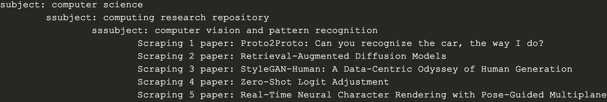

However, in scrapy, it is hard to print output along with scraping *sequentially*, we first scrape all pages and print all results all at once, however, during scraping, we print some information to give hints that upper limit is met if you set some `limit` parameters before.

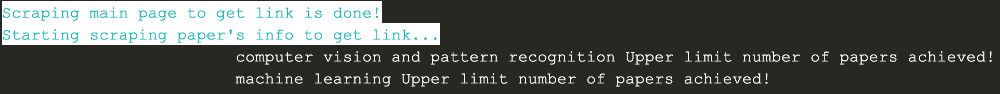

And scraped results are 

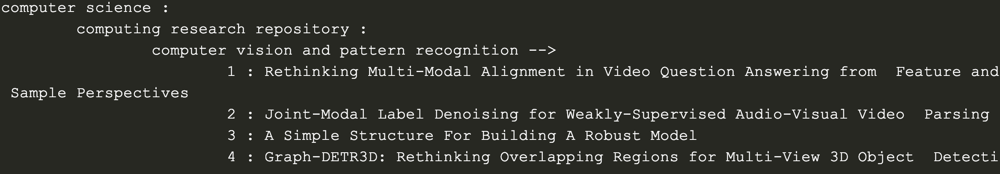

Note that results scraped are not in line with BS because BS runs code sequentially, Scrapy starts multiple crawlers concurrently. 
<<<<<<< HEAD
Next, if `scrape_each_author` in `soup` and `sscrapy` is True, then for each author, we ought to scrape his/her old papers. The results are marked with green color if obtained paper really belongs to that author, since multiple papers are searched if names of authors are similar, we have to filter them.
However, the mechanism is different for BS and Scrapy, we first scrape all authors' links, then scrape each of them one by one, in Scrapy, we utilize Depth-First Search(DFS), when getting each paper for each subsubsubject, then we continue to scrape its first author's papers. But BS and Scrapy will yield similar results shown below(**Note we don't do this step in selenium.**):
=======
Next, if `scrape_each_author` is True, then for each author, we ought to scrape his/her old papers. The results are marked with green color if obtained paper really belongs to that author, since multiple papers are searched if names of authors are similar, we have to filter them.
However, the mechanism is different for BS and Scrapy, we first scrape all authors' links, then scrape each of them one by one, in Scrapy, we utilize Depth-First Search(DFS), when getting each paper for each subsubsubject, then we continue to scrape its first author's papers. But BS and Scrapy will yield similar results shown below:
>>>>>>> e7b8b23db5988ddd218b6275de838a3c7e89c2f8

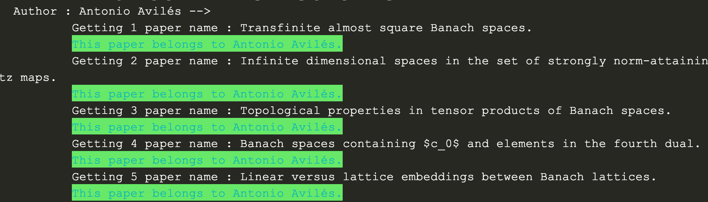

Finally, running time of each of scrapers will be recorded as stated above, and data analyses will be conducted, three tools use the same processing code, so the results are consistent as below,

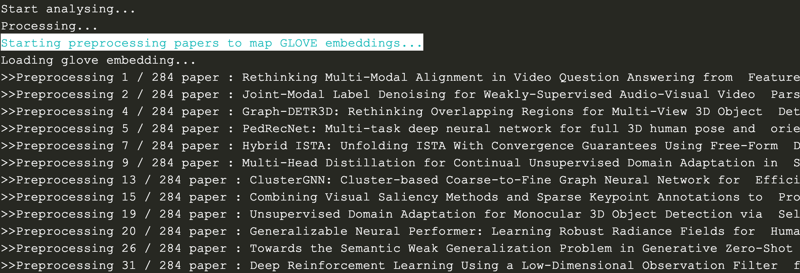
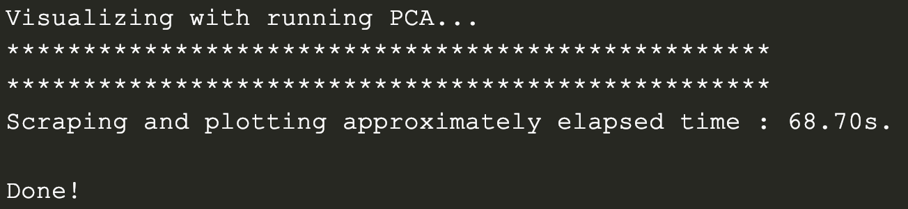

<<<<<<< HEAD
As we see preprocessing each paper is printed, and final running time is obtained as well. If `scrape_each_author` in `soup` and `sscrapy` is True, then we will see data analyses process be running twice, one for papers of all subsubsubjects and the other is for all papers for each of authors.

#### BS and Selenium running in `soup`/`sselenium` folder

In order to run files in `soup` or in `sselenium` respectively, enter the corresponding folder and type

```
python main.py
```
=======
As we see preprocessing each paper is printed, and final running time is obtained as well. If `scrape_each_author` is True, then we will see data analyses process be running twice, one for papers of all subsubsubjects and the other is for all papers for each of authors.
>>>>>>> e7b8b23db5988ddd218b6275de838a3c7e89c2f8

#### Scrapying running in the command line

According to project requirements, we must can run scrapy using `scrapy ...` command, in order to achieve this goal, we go into the directory `sscrapy/command/command` and type `scrapy crawl 'commandspider'`. Results and print console should look the same as before, since we use codes defined as above.

## Analyses 

### Running time comparisons

<table>
    <tr>
        <td>Tool</td>
        <td>Running Time(s)</td>
    </tr>
    <tr>
        <td rowspan="1">BS</td>
        <td>140.67±1.26</td>
    </tr>
    <tr>
        <td rowspan="1">Scrapy</td>
        <td>41.80±2.33</td>
    </tr>
    <tr>
        <td rowspan="1">Selenium</td>
<<<<<<< HEAD
        <td>77.21±2.41</td>
=======
        <td>±</td>
>>>>>>> e7b8b23db5988ddd218b6275de838a3c7e89c2f8
    </tr>
</table>

### Data analyses results

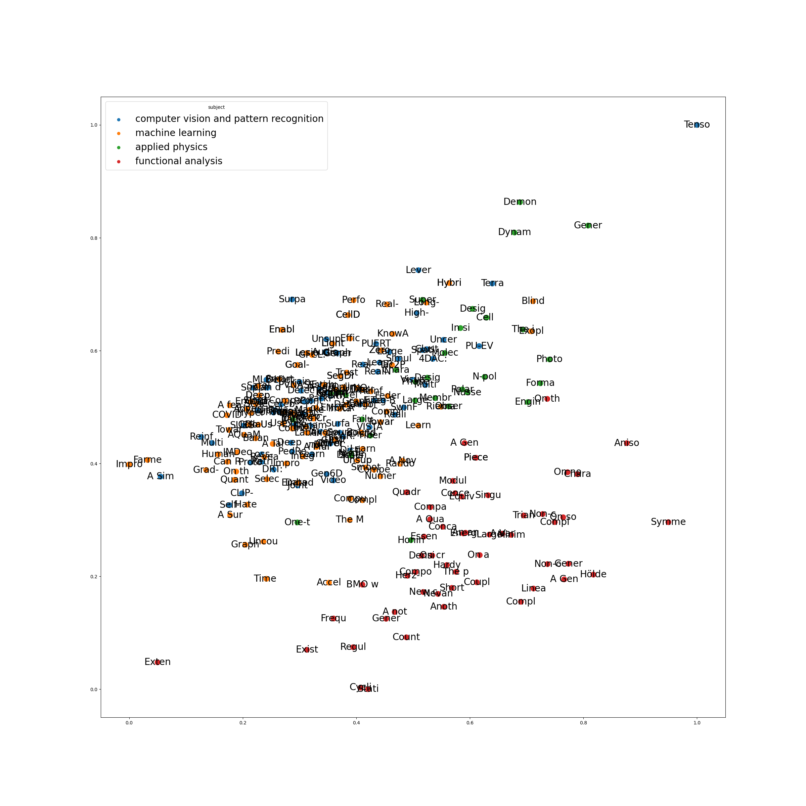
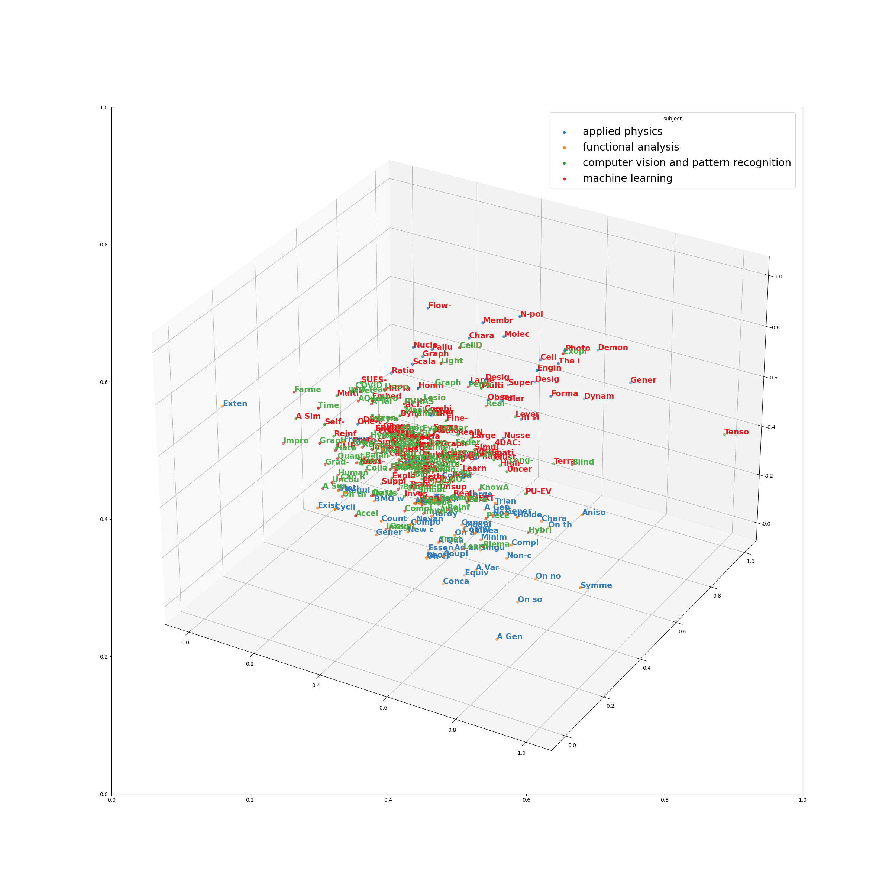
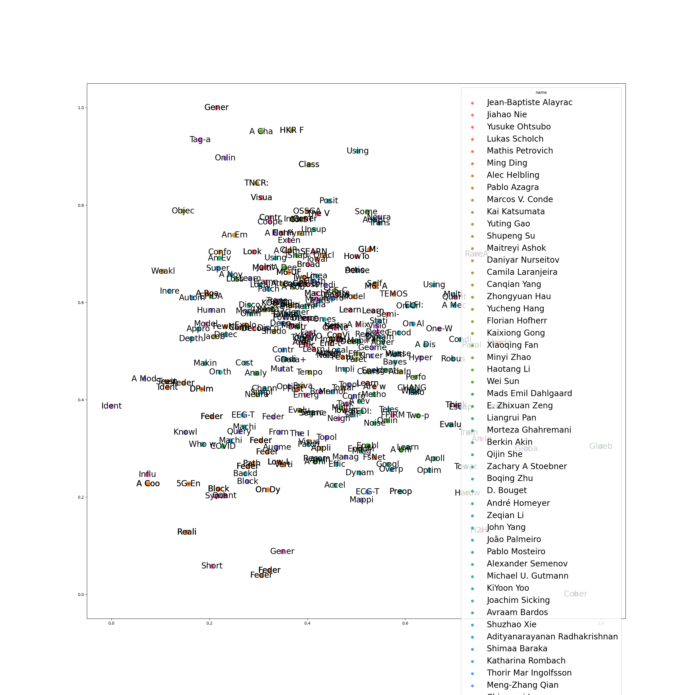
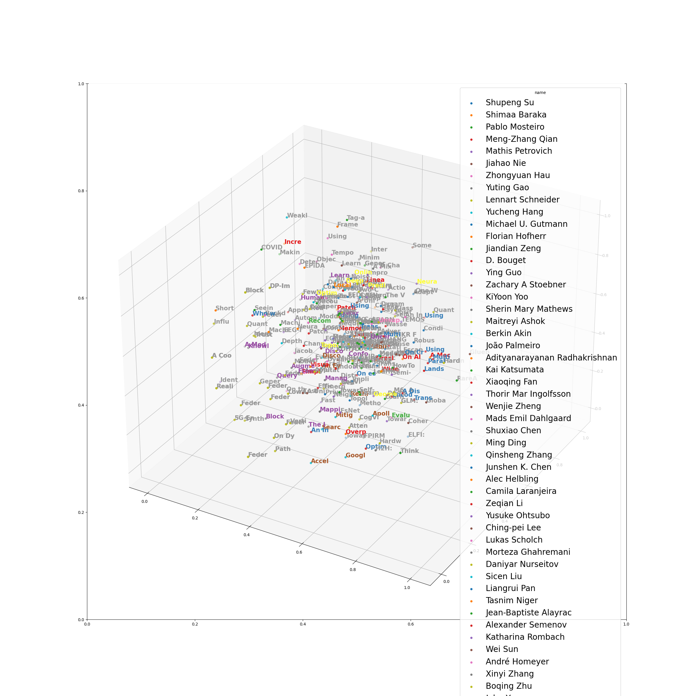

## Conclusion

In this project, we use three tools we grasped during lecture: BeautifulSoup, Scrapy and Selenium to scrape famous academic papers hosting platform: *ArXiv* to obtain each paper's information and each author's papers, finally we use scraped data to make visualization via simple NLP and PCA techniques and understand what's going on in the data. In the implementations, we've done quite a lot work to make every scrape correct.


<<<<<<< HEAD
<center>***Veni，vidi，vici --Caesar***</center>
=======
***<center>Veni，vidi，vici --Caesar</center>***
>>>>>>> e7b8b23db5988ddd218b6275de838a3c7e89c2f8

